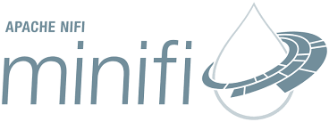

# Mm FLaNK
Mm FLaNK Stack (MXNet, MiNiFi, Flink, NiFi, Kafka, Kudu)

An All Apache Stack for real-time edge to AI analytics processing.

MiNiFi - Edge Computing
MXNet - Deep Learning Anywhere
Flink - Stream Processing
NiFi - Flow Management
Kafka - Stream Processing
Kudu - Column Oriented Data STore

